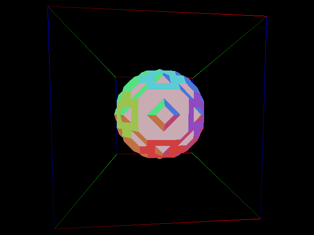

assign 1 - skew, twist, extrude, and sweeps on a polyset 
usage ./proj1 inputFileName outputFileName technique techniqueArgs  

possible techniques and args are  

skew skewX skewY 
twist degrees 
extrude extrudeAmount 
sweep steps degrees  

assign 2 - Marching Cubes Algorithm 
usage ./proj2 input_file output_file surfacelvl 

to make rd_file all of the .dat files have rows, cols, planes = 20, 20, 20 
./cview rows cols planes output_file > output.rd 

No Linear Interpolation and no Normals 

Linear Interpolation and no Normals 

Linear Interpolation and Normals 

