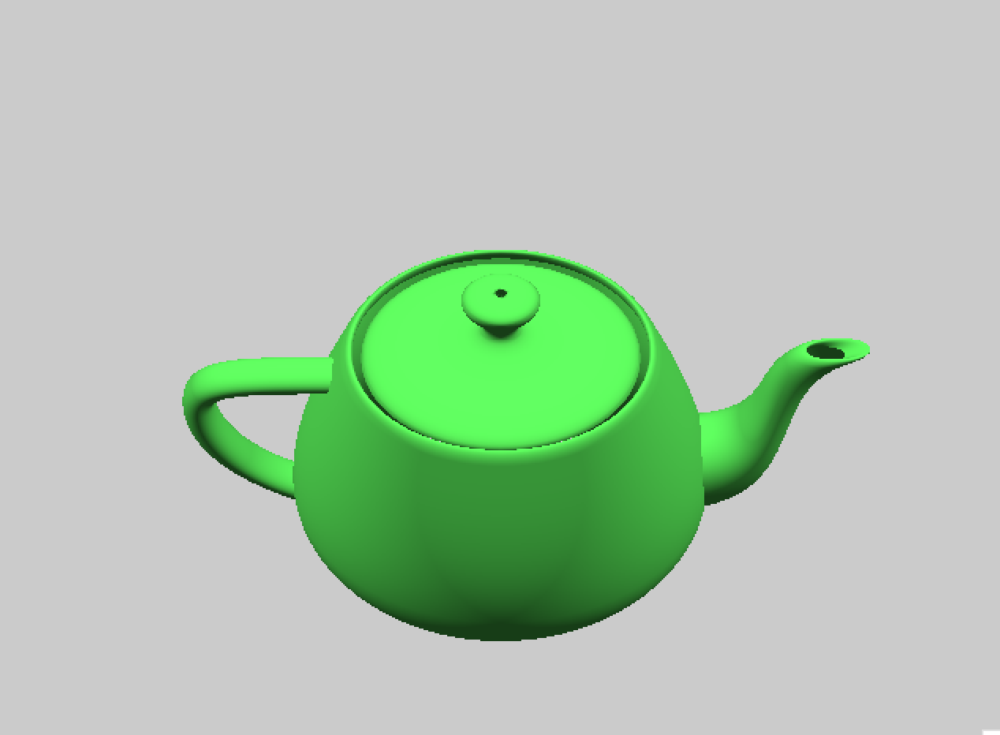
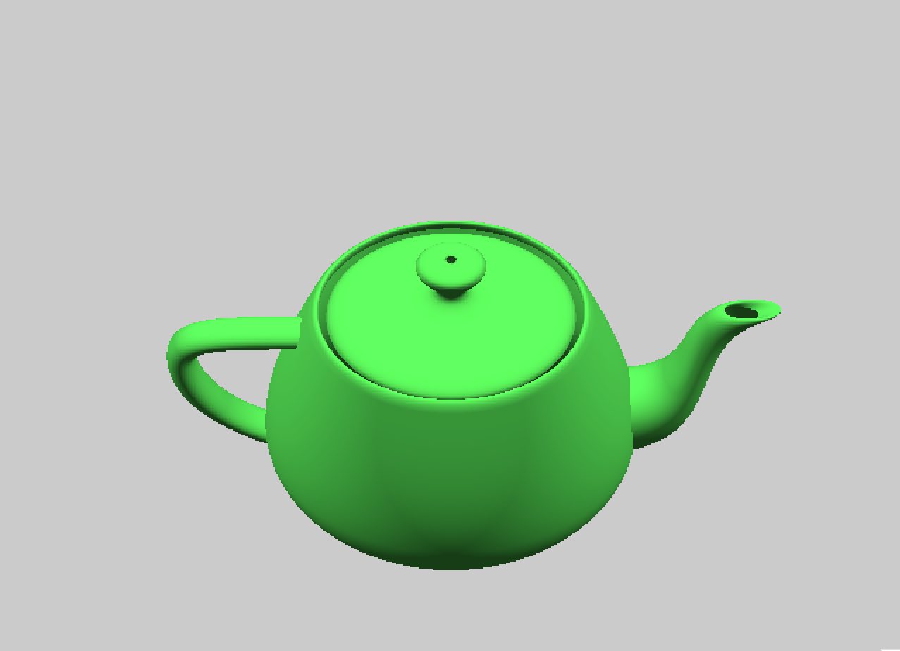

assign 1 - skew, twist, extrude, and sweeps on a polyset 
usage ./proj1 inputFileName outputFileName technique techniqueArgs 
possible techniques and args are 
skew skewX skewY 
twist degrees 
extrude extrudeAmount 
sweep steps degrees  

assign 2 - Marching Cubes Algorithm 
usage ./proj2 input_file output_file surfacelvl 

to make rd_file all of the .dat files have rows, cols, planes = 20, 20, 20 
./cview rows cols planes output_file > output.rd 
tests below are from file mc1.dat which is of 1 spherical field where mc2.dat is 2 spherical fields and mc3.dat is 4 spherical fields  
No Linear Interpolation and no Normals 
  
Linear Interpolation and no Normals 
  
Linear Interpolation and appoximated Normals (gif compression makes it appear less smooth) 
  

assign 3 - Bezier curves and surfaces 
usage ./rdv rdfile 
calculated with real surface normals at each point with ∂/∂u(bernstein polynomials) X ∂/∂v(bernstein polynomials) 
the teapot below is only with 10 subdivisions but calculated surface normals fake the smoothness much better than appoximation 
  
the teapot below is 100 subdivisions
  